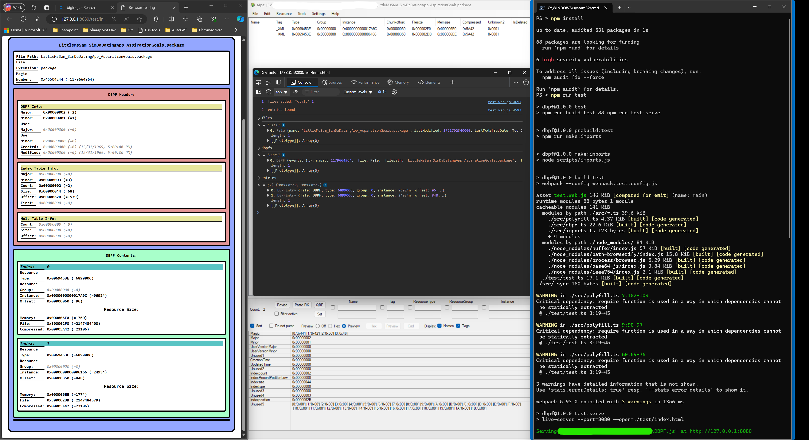

# DBPF.js a dbpf file reader in TypeScript

This is a simple library for reading DBPF files in TypeScript/JavaScript. Currently, it only parses the header and index, but a plugin system is planned to allow for reading and handling of the actual data.

## Building and Usage

This library can be used in both the browser and node.js. Currently, no releases are available, however building is simple:

```pwsh
git clone https://github.com/anonhostpi/DBPF.js
cd DBPF.js

# Install dependencies
npm install

# Build the library
npm run build

# Launch test environment
npm run test
# - sets up a local static server at http://localhost:8080 and opens a browser to a test page for interactive testing
```

Both the build and test build will use webpack to bundle the library for the browser.

The entry points are as follows:

Built files:
- `dist/dbpf.js` - The library for use in node.js
- `dist/dbpf.web.js` - The library for use in the browser
- `test/index.html` and `test/test.web.js` - The test environment for the browser

Source files:
- `src/dbpf.ts` - The main library
- `src/test.ts` - The test environment used by `npm run test`

